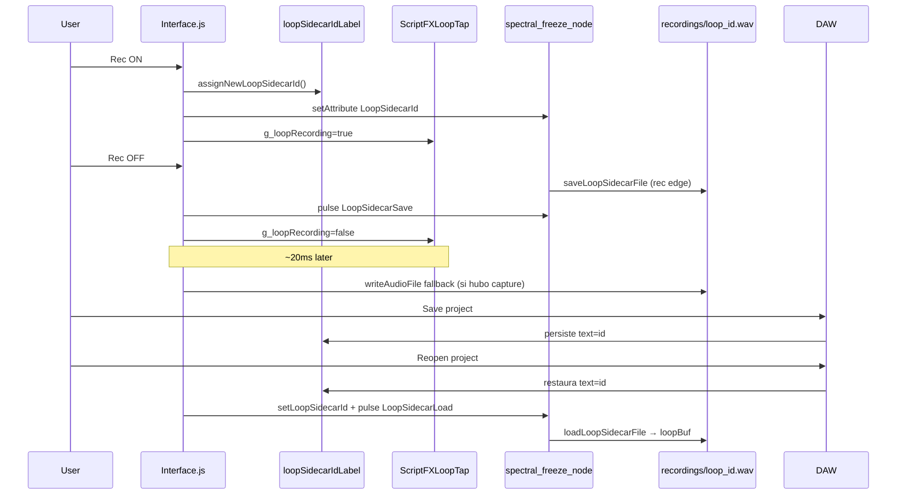

# Arquitectura — Loop sidecar

## Objetivo

Persistir el loop de 10 s del **Parallel Looper** entre sesiones de DAW, sin depender de que el host guarde el buffer RAM del C++.

## Modelo de datos

- **Un WAV por grabación completada**, nombre `loop_{id}.wav` con `id` entero aleatorio (9 dígitos).
- **Los WAV viejos no se borran** (Clear solo vacía RAM; no borra disco).
- **Un take “activo” por proyecto DAW**: el id se guarda en UI state, no en un txt global.

### Persistencia del id (solución final)

| Capa | Rol |
|------|-----|
| **`loopSidecarIdLabel`** (ScriptLabel oculto, `saveInPreset="1"`) | Fuente de verdad para el script; Logic/DAW lo serializa al guardar el proyecto |
| **`LoopSidecarId`** (P13 en `spectral_freeze_node`) | Espejo en C++ para path `loop_{id}.wav` en save/load |
| **`LoopSidecarLoad` / `LoopSidecarSave`** (P14/P15) | Pulsos momentáneos 0→1→0 desde script |

Default del label: `"0"` → plugin recién compilado no carga ningún WAV.

## Rutas de archivo

Patrón **Tactile** (`FileSystem.AudioFiles/recordings`):

| Entorno | Carpeta real |
|---------|----------------|
| HISE editor | `{PROJECT_FOLDER}AudioFiles/recordings/` |
| Plugin exportado (macOS) | `~/Library/Application Support/Sampleson/Aeronaut/AudioFiles/recordings/` |

Requiere en `project_info.xml`:

```xml
<ExtraDefinitionsOSX value="USE_RELATIVE_PATH_FOR_AUDIO_FILES=1"/>
<ExtraDefinitionsWindows value="USE_RELATIVE_PATH_FOR_AUDIO_FILES=1"/>
```

El C++ usa la misma convención vía `AppData/Sampleson/Aeronaut/AudioFiles/recordings/` (export).

## Cadena de audio (orden crítico)

```
Synth → Simple Gain Makeup → ScriptFXLoopTap → HardcodedMasterFX1 → ScriptFX1 → …
                              ↑ dry tap           ↑ looper C++          ↑ prepareToPlay sync
```

- **Looper C++** graba el dry input **dentro** del nodo (antes del freeze).
- **ScriptFXLoopTap** captura el mismo dry en script (fallback `writeAudioFile` si falla save C++).

## Flujo temporal



## Save dual (por qué)

1. **Primario:** C++ `loopBuf` → WAV (sample-accurate, independiente del block size del host).
2. **Fallback:** script `writeAudioFile` desde `g_loopAccumulator` (~20 ms después, solo si hubo captura en ScriptFXLoopTap).

El fallback usa `resolveSidecarSampleRate()` (nunca `Engine.getSampleRate()` a ciegas si es 0).

## Load dual

1. **`initLoopSidecar()`** → `scheduleLoopSidecarBootReload()` (150 ms).
2. **`freezerWakeTimer`** (50 ms) → `rePushAllAttributes` + `reloadLoopSidecarFromDisk()`.
3. **`onHostAudioReconfigured()`** → `reloadLoopSidecarFromDisk()` (driver/buffer change).

Siempre antes de load: `setLoopSidecarId(id)` para sincronizar el miembro C++.
