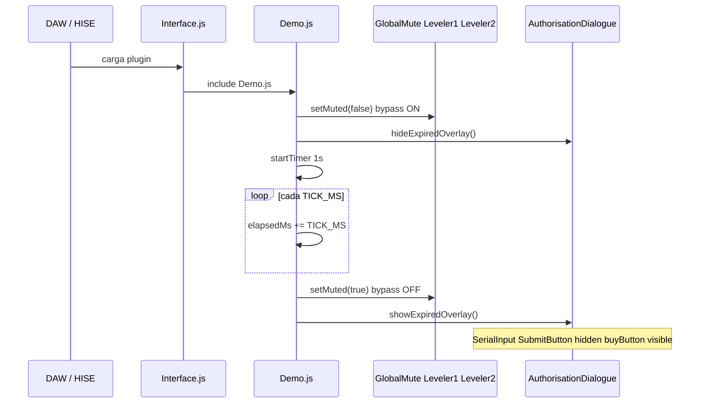

# Portar `Demo.js` a cualquier proyecto HISE

Guía genérica para añadir un **build demo con límite de tiempo** a un plugin que ya usa `Authorisation.js`. No cubre otras features del producto (sidecar, DSP extra, etc.) — solo el runtime demo.

Referencia de implementación: `Scripts/Demo.js`.

---

## Qué hace `Demo.js`

| Comportamiento | Detalle |
|----------------|---------|
| Arranque | Audio **sin mute** (`setMuted(false)`) |
| Timer | 1 Hz, cuenta `elapsedMs` en RAM |
| Expiración | Tras `DEMO_TOTAL_MS`, activa mute y muestra overlay |
| Persistencia | **Ninguna** — recargar el plugin resetea el contador |
| Mute | Tres `SimpleGain` en cadena: `GlobalMute`, `Leveler1`, `Leveler2` |
| UI | Reutiliza el diálogo de licencia como pantalla “Demo expired” |
| CTA | `buyButton` (ScriptPanel pintado en script) abre `BUY_URL` |

`Demo.js` es **autocontenido**: un solo `include()` en `Interface.js`. No requiere hooks en el resto del script de UI.

---

## Prerrequisitos en el proyecto destino

### 1. Cadena FX — IDs fijos

El script resuelve efectos por nombre:

```javascript
Synth.getEffect("GlobalMute");
Synth.getEffect("Leveler1");
Synth.getEffect("Leveler2");
```

En el preset XML deben existir **tres** `SimpleGain` con esos `ID` exactos, con `Gain="-100.0"`.

Patrón de mute (convención HISE):

| Estado | `setBypassed` | Efecto |
|--------|---------------|--------|
| Sonido audible | `true` | Gain -100 **bypassed** → no afecta |
| Demo expirado | `false` | Gain -100 **activo** → silencio |

**Factory preset recomendado:** los tres mutes con `Bypassed="1"` (igual que el build full con licencia). `Demo.js` llama `setMuted(false)` al init; así no hay flash de mute antes de que corra el script.

### 2. Componentes UI — IDs fijos

| ID | Tipo | Uso |
|----|------|-----|
| `cristalPanel` | ScriptPanel | Backdrop semitransparente del overlay |
| `AuthorisationDialogue` | ScriptPanel | Contenedor del diálogo |
| `SerialInput` | ScriptLabel | Oculto al expirar (resto de licencia) |
| `SubmitButton` | ScriptButton | Oculto al expirar |
| `buyButton` | ScriptPanel | Botón celeste pintado en script (`allowCallbacks="All Callbacks"`) |

Opcional (solo banner demo en la barra superior):

| ID | Tipo |
|----|------|
| `linkLabel` | ScriptLabel — texto “[DEMO MODE] …” |
| `linkPanel` | ScriptPanel — área clickeable (en `Interface.js`, no en `Demo.js`) |

Si falta un componente, el script usa `if (Component)` y sigue; el botón buy y el overlay necesitan `AuthorisationDialogue` + `buyButton` + `cristalPanel` para UX completa.

### 3. Build con licencia previo

El proyecto destino debe tener ya:

- `Authorisation.js` funcionando
- UI de licencia (`AuthorisationDialogue`, `SerialInput`, `SubmitButton`, …)
- Los tres mutes en la cadena master

`Demo.js` **sustituye** `Authorisation.js`, no convive con él en el mismo `Interface.js`.

---

## Checklist de implementación

### Paso 1 — Copiar y adaptar `Demo.js`

Copiar `Scripts/Demo.js` al proyecto destino (misma ruta `Scripts/` para que `include("Demo.js")` funcione).

Editar constantes al inicio del namespace:

```javascript
const var DEMO_TOTAL_MS = 8 * 60 * 1000;   // duración del demo
const var TICK_MS       = 1000;            // resolución del timer
const var BUY_URL       = "https://…";     // landing del producto
```

Personalizar en `BuyButton.setPaintRoutine`:

- Texto del botón (`drawAlignedText`)
- Colores (`BTN_COL_*`) si querés otra marca

### Paso 2 — Segundo ScriptProcessor (recomendado)

Patrón **dos builds, un repo**:

1. Duplicar carpeta `Scripts/ScriptProcessors/<Product>/` → `Scripts/ScriptProcessors/<Product>_demo/`
2. En `<Product>_demo/Interface.js`, **único cambio** respecto al full:

```javascript
include("menuPanels.js");
include("Demo.js");          // ← en lugar de Authorisation.js
```

3. Duplicar preset backup: `XmlPresetBackups/<Product>.xml` → `XmlPresetBackups/<Product>_demo.xml`
4. Cambiar el `ID` del SynthChain raíz a `<Product>_demo` (debe coincidir con el nombre del ScriptProcessor activo en HISE)
5. Duplicar UIData: `<Product>UIData/` → `<Product>_demoUIData/`

En HISE: cargar el preset `_demo`, verificar que el ScriptProcessor apunta a la carpeta `_demo`.

**Alternativa mínima:** un solo `Interface.js` y cambiar el include a mano antes de cada export demo — viable pero propenso a errores.

### Paso 3 — UIData del build demo

Adaptar textos del diálogo (no hace falta tocar `Demo.js` si los IDs son iguales):

- `TitleLabel` → p. ej. `"Demo Expired"`
- `Description` → mensaje de tryout terminado
- `SerialInput`, `SubmitButton` → `visible="0"` en el XML (Demo.js también los oculta al expirar)
- Añadir `buyButton` dentro de `AuthorisationDialogue` si no existía en el layout de licencia full

Ejemplo mínimo de `buyButton`:

```xml
<Component type="ScriptPanel" id="buyButton" x="142.0" y="220.0"
           parentComponent="AuthorisationDialogue" width="318.0" height="55.0"
           allowCallbacks="All Callbacks" bgColour="0" itemColour="0" itemColour2="0"/>
```

Banner demo opcional en el desktop XML + en `Interface.js`:

```javascript
var linkPanel = Content.getComponent("linkPanel");
if (linkPanel)
{
    linkPanel.setMouseCallback(function(event)
    {
        if (event.clicked)
            Engine.openWebsite("https://…");
    });
}
```

### Paso 4 — Preset XML (cadena demo)

Respecto al preset full, el demo suele ser **idéntico** salvo:

- `ID` del SynthChain = `<Product>_demo`
- Mutes `GlobalMute` / `Leveler1` / `Leveler2`: preferible `Bypassed="1"` en factory (ver prerrequisitos)

No hace falta duplicar lógica DSP distinta para el demo salvo que el producto lo requiera por otro motivo.

### Paso 5 — Export

Al exportar el binario demo:

- Cambiar **nombre visible**, **PluginCode** y/o **BundleIdentifier** si querés convivencia con el full en el mismo DAW (p. ej. sufijo `Demo`)
- Cargar preset `<Product>_demo` antes de “Export as VST3/AU”
- Confirmar ScriptProcessor = carpeta `_demo`

`Demo.js` no escribe archivos en AppData ni en el preset del DAW.

---

## Flujo en runtime



---

## API interna (`namespace Demo`)

| Función | Uso |
|---------|-----|
| `setMuted(isMuted)` | `true` = silencio (desactiva bypass en los tres gains) |
| `showExpiredOverlay()` | Muestra `cristalPanel` + diálogo; oculta controles de licencia |
| `hideExpiredOverlay()` | Estado inicial |

No hay funciones públicas que el resto de `Interface.js` deba llamar.

---

## Pruebas

1. **Instancia nueva** — audio audible de inmediato; overlay oculto.
2. **Reducir `DEMO_TOTAL_MS`** temporalmente (p. ej. `30 * 1000`) — a ~30 s mute + overlay.
3. **Buy** — click en `buyButton` abre URL (probar en plugin exportado, no solo editor).
4. **Recarga** — quitar y volver a insertar el plugin: contador vuelve a 0 (comportamiento esperado).
5. **Convivencia full/demo** — si exportás ambos, verificar IDs de plugin distintos en el DAW.

---

## Errores frecuentes

| Síntoma | Causa probable |
|---------|----------------|
| Demo nunca mutea | IDs `GlobalMute` / `Leveler1` / `Leveler2` no coinciden con la cadena |
| Mute desde el primer sample | Factory con `Bypassed="0"` en mutes; usar `Bypassed="1"` o aceptar flash hasta init |
| Overlay sin botón | Falta `buyButton` o sin `allowCallbacks="All Callbacks"` |
| Sigue pidiendo licencia | Sigue incluido `Authorisation.js` en lugar de `Demo.js` |
| Timer no corre | Error de script anterior que aborta el namespace; revisar consola HISE |

---

## Qué **no** incluye esta guía

- Persistencia de sesión demo en disco
- Sidecar / grabación / features DSP adicionales
- Cambios en `Authorisation.js` del build full
- Protección anti-tamper (el límite es solo script + mute)

Para esas features, documentación aparte en el resto de `demo_agents/`.

---

## Archivos mínimos a transferir a otro repo

```
Scripts/Demo.js
Scripts/ScriptProcessors/<Product>_demo/Interface.js   ← copia del full, include Demo.js
XmlPresetBackups/<Product>_demo.xml
XmlPresetBackups/<Product>_demoUIData/<Product>_demoDesktop.xml
demo_agents/PORT_AERONAUT_DEMO.md                    ← esta guía
```

El resto del proyecto demo puede ser copia 1:1 del full con los cambios de esta checklist.
